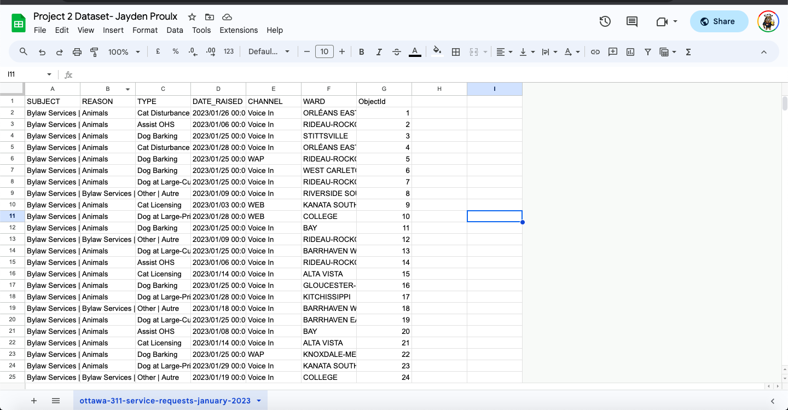
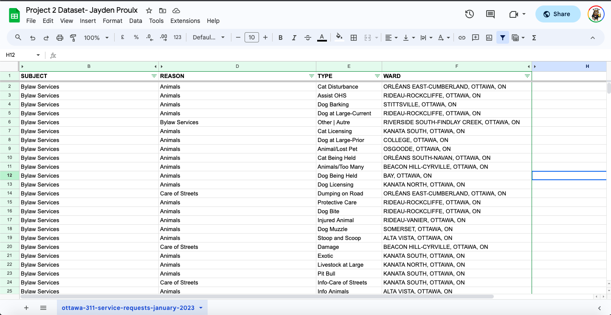
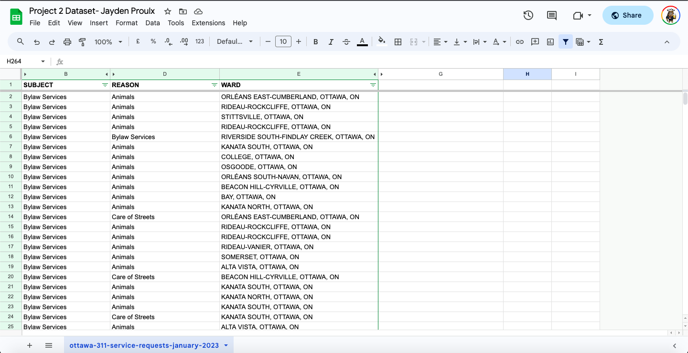
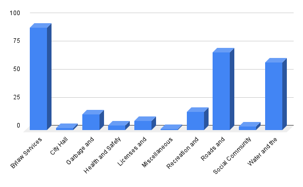
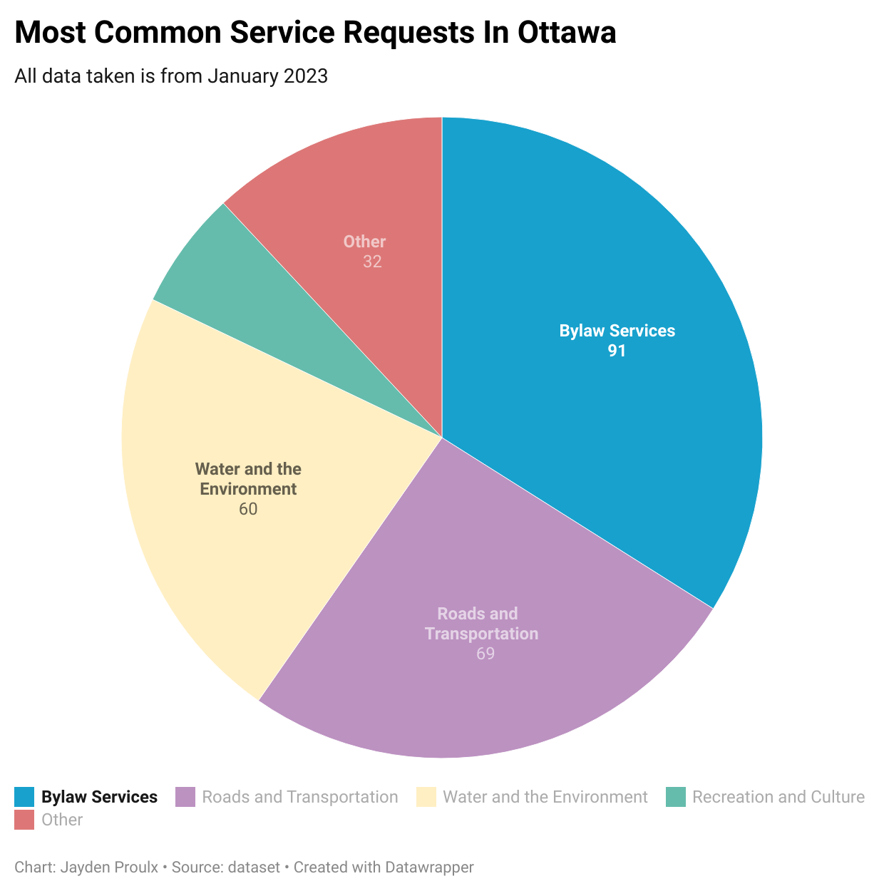

**November 22nd 2023** 
**MPAD 2003A Introdcutory Data Storytelling** 
 Jayden Proulx  
**Presented to Jean-Sébastien Marier** 

https://github.com/JMoneyProulx/mpad2003_project1_-Jayden-Proulx-.git

# Project 2: Basic Data Analysis & Visualization

## 1. Introduction
In this assignment, I will be analyzing a City of Ottawa dataset about monthly service requests in January 2023. The data shows the responsible City department and service request description. The data includes different services such as Bylaw Services, Road and transportation services, and Water and Environment Services. It also includes request subjects such as animals, fireworks, and fences. The main sections of the assignment will include: Getting Data, Understanding Data, Delivering Data, and a conclusion!

Link to original dataset: https://open.ottawa.ca/datasets/ottawa::2023-monthly-service-requests/explore

CSV Link: https://raw.githubusercontent.com/jsmarier/course-datasets/main/ottawa-311-service-requests-january-2023.csv

## 2. Getting Data

To import the data provided into a dataset it's pretty simple. I first opened the dataset link provided on the brightspace and downloaded it as a CSV file. I then created a brand new Google Sheets template. I went over to the file, clicked import, and imported the dataset that I downloaded to my computer. I was prompted with a separator type and I chose "comma". Finally, clicked import and the dataset was imported into my Google Sheets document.
Upon opening the dataset, I can tell that there is a lot of data. My first observation is that there are 7 columns with different titles. I also realized that in the objects collum, all of the objects are in order starting from 1 to 26845. With that being said, it took a while to find out how many rows there are in this dataset since there is so much data. I came to the realization that there are 26845 rows and that this dataset is very messy, disorganized, and needs to be simplified.
As previously mentioned the "OBJECTS" collum is in order from numbers 1-26845. I also noticed that in the "SUBJECT" collum there are many different subjects such as Bylaw Services, Corp complaints, Garbage and recycling, Recreation and Culture, Roads and Transportation. Finally, a last initial observation was that in the "Dates Raised" column I noticed that all of the dates recorded are in January 2023 making the data recent.
What's the most common subject in Ottawa that services are requested the most?

 
*Figure 1: The "Import file" prompt on Google Sheets.*

## 3. Understanding Data

### 3.1. Cleaning Data

 The first cleanup method I used was the remove duplicates feature. Obviously, this dataset is filled with a bunch of rows. In my opinion, to get to my conclusion, I don't need duplicates. By clearing all the duplicates in this data, I was able to cut down the amount of data to 312 rows which is still a lot of information, but it cleaned up a lot of data and will make my life a lot easier to get to the conclusion on what's the most common subject and reason in Ottawa that services are requested the most?
I then proceeded to Freeze the 1st row of the spreadsheet. The first row is all the titles of the columns and it helps with the visibility and navigation of the data. I then went on to use the "Split" and "Concatenate" functions. Firstly, for the Split function, I noticed a lot of the data was written both in English and in French. I then created 2 different columns splitting the languages in half using this code: =SPLIT(A2, "|"). This gave me the opportunity to only use the English term rather than both. It makes the data more organized and more sorted. I then used the Concatenate function to implement the city and province of each location in the dataset. That being "Ottawa, On". It adds a full name and a precise location making it clearer when viewing. The code I used was : =CONCATENATE(G2,", OTTAWA, ON"). Finally, I removed columns that weren't important for my conclusion. I kept it as simple as I could so it's easy to navigate and simplify the story the dataset is trying to tell.

 

### 3.2. Exploratory Data Analysis

 I chose these specific variables because of my hypothesis. I wanted to find out, which one of the subjects is the most common service in Ottawa in 2023. Therefore, when making the chart on Google Sheets, I used the "SUBJECTS" variable in order to answer my question. In my opinion, no particular statistic really stood out to me, initially I thought that the Bylaw services would've been the most popular service in Ottawa. Going back to Covid days, I knew Bylaw services were very popular. According to a CBC article, "Ottawans made more than 11,000 more calls to bylaw between April 2020 and March 2021." It was an increase of 20%. Furthermore, according to a different CBC article "more than 13 000 pandemic related calls for officers to patrol parks". Therefore, I knew the popularity of the Bylaw services from 2-3 years ago and it doesn't surprise me that it is the most popular service. I learned that the Bylaw services in Ottawa are the most popular as of January 2023, but more specifically the subject most popular when calling Bylaw services is Animals. The story here is that as of January 2023, out of every service available in the city, the Bylaw Services are the most popular. Something I didn't know but am not surprised by. In my main visualization, I want to show the different services in Ottawa, I want to show the most and least popular services to show the public the differences in the requests per service.

  
  

## 4. Delivering Data

 I formatted the data into a pivot table in order to insert it into Datawrapper. I found it easy to copy the pivot table and paste it into the app. I chose a pie chart because I'm trying to display each of the services in Ottawa and how many requests they get. I want to demonstrate which service is the most popular and by using a pie chart the second you look at it, it's very easy to tell that it's the Bylaw Services. Furthermore, the pie chart displays the number of requests on the chart so it's very easy for someone to see the number. The color scheme I went with is very simple. I just wanted to have a different color for each of the 5 services I was displaying on the chart. It makes it easy to notice which one is the most popular. For my case, it's easy to tell that the color blue is taking up a majority of the circle, therefore you can look at the title and see that it's the Bylaw Services.

**This section should include a screen capture of your chart and its public link, like so:**

 
*Figure 2: The map created with Datawrapper*
[Interactive version here](https://datawrapper.dwcdn.net/9tKVu/1/)

## 5. Conclusion

In conclusion, the potential story from this dataset is that the Bylaw services have the most popular requests as of January 2023. I found my cleaning up the data with methods I learned from class helped me get to that conclusion by making the dataset clean, simple, and organized. In my opinion, the story is pretty noticeable. But, with that being said there's always room for more data and to truly get to the bottom of the story we would need data all throughout the year 2023, to find out which services are truly the most requested in Ottawa.

## 6. References

Last, John. CBC: Loud music, bad lawns and lots of rats: Bylaw complaints soar during pandemic. https://www.cbc.ca/news/canada/ottawa/bylaw-calls-2020-2021-1.6125541

Chat GPT: Questions such as how to freeze rows and columns in google sheets

Porter, Kate. CBC: Bylaw call volume not 'sustainable,' says department head. https://www.cbc.ca/news/canada/ottawa/bylaw-officers-unsustainable-calls-per-staff-1.6178747